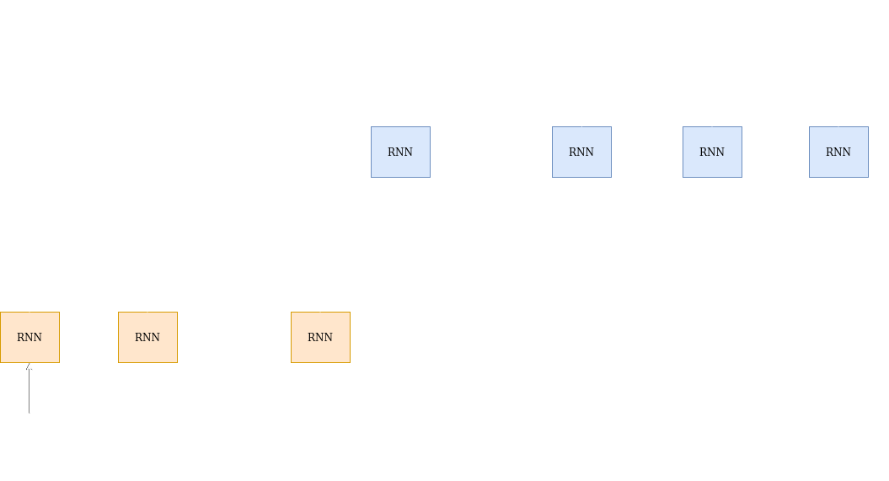

Sequence to sequence(seq2seq) learning is a powerful idea in deep learning. At it's core it is a simple idea. The idea of sequence to sequence learning is

> To map an input sequence of given length, to an output sequence. 

Note, that the length of the input and output sequences need not be same.

## Applications of sequence to sequence models

A lot of problems that you face daily can be formulated as sequence to sequence mapping problems. For example:-

1) Machine Translation:- Machine translation can be thought of as a seq2seq problem where the input sequence is the source language sentence and the output sequence is the target language sentence. 
In a lot of cases NMT outperforms traditional Statistical Machine Translation approaches.

2) Speech recognition:- Speech recognition is also a sequence to sequence problem, where the input is a feature vector sequence and the output is the desired word sequence.

## Why is seq2seq learning needed

Before we get to the architecture of seq2seq models, it is worth answering the question why such models are needed in the first place.
Why do we need a new architecture for mapping some sequence to another sequence, can't simple neural nets(DNN,CNN,RNN,etc) be used?

The reasons why we need a new architecture are:-
* Seq2seq models have the ability to map sequences of different lengths to each other. For instance:- When translating a sentence from English to Hindi, it is not necessary that the Hindi sentence have the same length as the English sentence. In conventional DNN classifiers, every input vector has an associated label, hence the length of the output vector sequence will always be equal to the length of the input vector sequence.

* Seq2seq models can make excellent use of contextual or temporal information. For example:- Speech makes sense only when we take it's temporal aspect into account, a single word spoken does not make sense, but a sequence of spoken words form a sentence which actually has meaning.

## Basic Encoder Decoder architecture

Let's define some terms before understanding the architecture

$$x_1$$

*X=(x1,x2,...,xN)* is the input vector sequence  
*Y=(y1,y2,...yM)* is the output vector sequence  
*H = (h1,h2,,...hN)* is the hidden vector sequence

The encoder is a RNN(LSTM,GRU,etc). The encoder tries to summarize the input it has seen. At time step *t*, the encoder has a hiddent state *ht*. Think of *ht* as a summary of all the inputs till time *t* with an emphasis on the input vector *xt*.

The hidden vector at any time is a function of the current input vector and the previous hidden vector:
ht + 1 = f(ht,xt + 1)

At time step N, the encoder generates the hidden vector *hN*. The main idea is: this hidden vector *hN* is a summary of all the input vectors *x1...xN*. This is also called the ***context vector***. The decoder then uses this context vector to generate the desired output sequence.

We feed a special *\<sos\>*(start of sequence) symbol to the decoder along with the context vector, to start generating output symbols yi. The next symbol *yi + 1* is a function of the decoder state *si + 1* and *yi*.

*yi + 1 = f(yi,si + 1)*

The decoder state si + 1 is further a function of the previous state and the previous output.

*si + 1 = g(yi,si)*

**g()** is a function that the decoder learns to update it's hidden state.

The decoder keeps generating output till it finally predicts a special *\<eos\>*(end of sequence) token. Thus the decoder generates the output sequence *Y=(y1,y2,...yM)*

