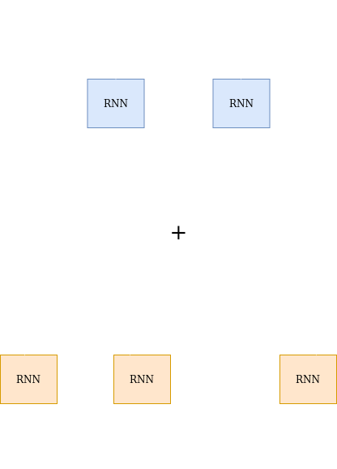

# Attention mechanism in seq2seq models

In the previous post we saw sequence to sequence models and how they are used for a variety of tasks. In this post we will discuss the attention mechanism, which is an extension to sequence to sequence models.

## Summary of sequence to sequence models

*X=($x_1$ ,$x_2$,...,$x_N$)* is the input vector sequence  
*Y=($y_1$,$y_2$,...$y_M$)* is the output vector sequence  
*H=($h_1$,$h_2$,,...$h_N$)* is the hidden vector sequence

$h_N$ is a fixed dimensional summary of the input sequence. The decoder uses it to generate the output sequence.

## Problems in Encoder-Decoder

The performance of the network suffers if the input sequence is very long. Imagine something like training a speech recognition system on training data which had an average sentence duration of 2 minutes and then at test encountering real world data where the sentences are well over 10 minutes long. In such a case using only the last hidden state of the encoder as the context vector gives inaccurate results.

## Attention mechanism

The attention mechanism addresses this problem by retaining all hidden states and selecting the most relevant hidden states to generate output at the current time step.

The attention mechanism solves the problem of generating a relevant context vector at every time step by linearly combining all hidden vectors with different weights. Thus, we don't have to rely on the final hidden vector to summarize the entire input sequence. Additionally the context vectors generated are relevant to the current time step. 

For example:- Suppose we are building a model for speech recognition. The utterance is "Show me the map of Mumbai". Now if we were to use a plain vanilla seq2seq model we can't assign importance to the hidden states based on the time step. It's clear that for generating the first word the initial hidden vectors are more important than the later ones. Since the plain seq2seq model uses only the final hidden vector as the context vector, it can't selectively focus on the relevant input. On the other hand during the initial time steps, the attention mechanism can assign more importance to the first few hidden vectors to generate a context vector. It can generate a better context vector to predict the output.

The image below is the summary of the attention mechanism:-

Instead of using only the $h_N$ as the context vector, the decoder combines all the hidden states $h_1$,$h_2$,,...$h_N$ to generate a context vector $C_i$. This context vector is used to generate the output at the $i^{th}$ time step. 

In a standard decoder RNN the output symbol $y_i$ is a function of the current decoder state($s_i$) and the previous output symbol($y_{i - 1}$).

$y_i$=f($y_{i - 1}$,$s_i$) and the current decoder state is a function of the previous decoder state and the previous output symbol

$$s_i=g(y_{i - 1}, s_{i - 1})$$
 
 In the attention mechanism instead of just using the previous state and previous output symbol to update the current decoder state, we also use the context vector $C_i$ .

$$s_i=g(y_{i - 1}, s_{i - 1}, C_i)$$

The context vector $C_i$ is a linear combination of all the hidden state vectors $h_1$,$h_2$,,...$h_N$. 
Mathematically,

$$C_i=\sum_{j=1}^N\alpha_{ij}h_i$$(1)

Equation (1) basically means that the context vector is a weighted sum of all the hidden vectors with the $\alpha_{ij}$ being the weight assigned to the $i^{th}$ hidden vector $h_i$.   

$$\alpha_{ij}=\frac{\exp(e_{ij})}{\sum_{k=1}^N\exp(e_{ik})}$$(2)

 

$$\alpha_{ij}=Softmax(e_{ij})$$(3)

 

$$\sum_{j=1}^N\alpha_{ij}=1$$(4)

 

$$e_{ij}=a(s_{i - 1},h_j)$$ (5)

$a$ is an alignment function(also known as compatibility function) that computes the the importance of a hidden vector $h_j$ with the decoder state $s_{i - 1}$.The main difference between the different kinds of attention mechanisms is the alignment function $a$ . 
